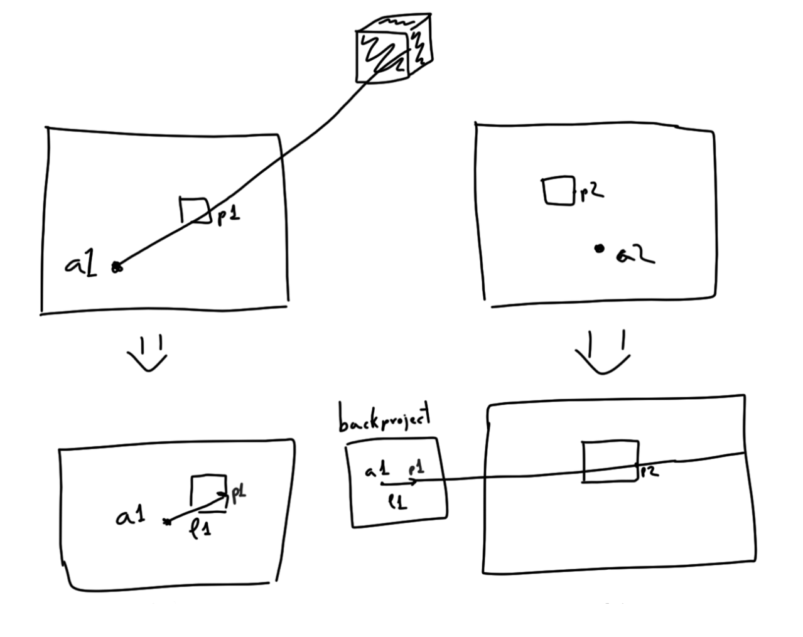
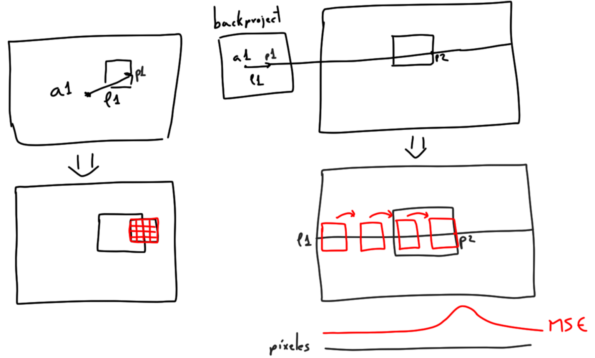
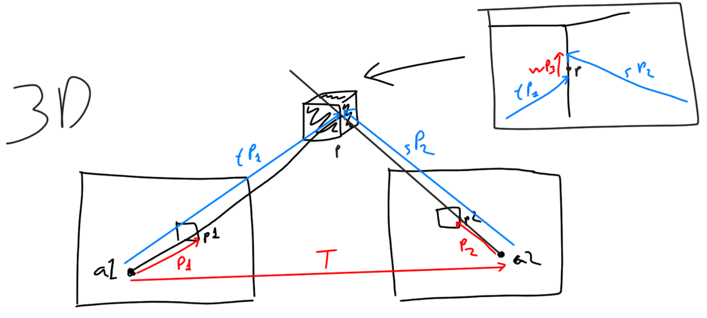
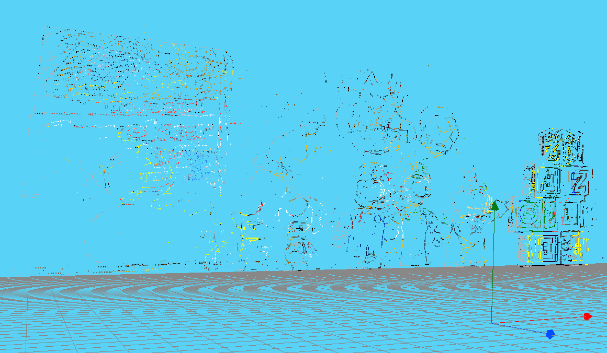
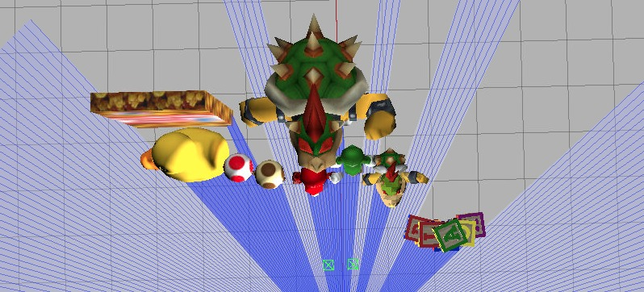
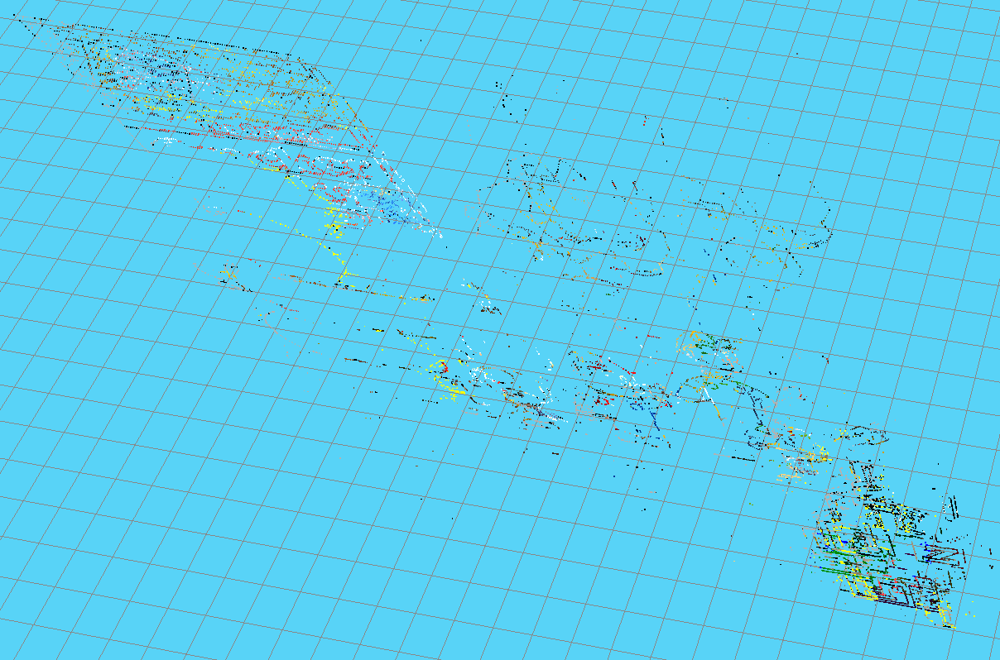

# 3D Reconstruction

## Index
+ [Familiarization with the environment](#familiarization-with-the-environment)
+ [Find matches](#find-matches)
+ [Triangulation](#triangulation)
+ [Optimization](#optimization)
+ [Results and conclusions](#results-and-conclusions)
## Familiarization with the environment
The first thing to do was to set up the practice environment, for this I used the following [website](https://unibotics.org/academy/exercise/3d_reconstruction/). It describes the necessary steps to set up the website, although some sections are outdated. Our teacher took care of detailing the missing steps.

1. Clone the Robotics Academy repository on your local machine.
```
git clone https://github.com/JdeRobot/RoboticsAcademy
```
2. Download [Docker](https://docs.docker.com/get-docker/).
3. Pull the current distribution of Robotics Academy Docker Image.
```
docker pull jderobot/robotics-academy
```
4. On the local machine navigate to the follow_line exercise which is: RoboticsAcademy/exercises/follow_line/web-template/assets/websocket_address.js, change the variable websocket_address to the IP address through which the container is connected. Usually for Linux machine it is 127.0.0.1 and for Windows is 192.168.99.100.

5. Start a new docker container of the image and keep it running in the background.
```
docker run -it -p 8000:8000 -p 2303:2303 -p 1905:1905 -p 8765:8765 -p 6080:6080 -p 1108:1108 jderobot/robotics-academy python3.8 manager.py
```
6. Sign up and sign in at [Unibotics](https://unibotics.org/).
7. Go to the exercise [3D Reconstruction](https://unibotics.org/academy/exercise/3d_reconstruction/).

To familiarize myself with how the environment works, I first tried painting a point with a given color in the 3D environment. In addition, I tried applying canny filtering on the images from both cameras and displaying them on the console. Once I achieved these small goals, I started to consider the rest of the steps to solve the practice.

## Find matches
To achieve this objective I have followed these steps:

### 1. Preprocessing of the images.
I have performed a Laplacian filtering of the images, this returns me two one-channel matrices with the edges of the figures in the image in a range between 0 and 255.

Then, I converted the images from BGR to HSV, the resulting 3-channel images were used to measure the difference between patches of the two images.

### 2. Epipolar calculation
As can be seen in the figure of this subsection, the epipolar line can be obtained by projecting the points p1 and a1 on the left camera. With these points a line l1 is generated and by calculating the intersections with the limits of the images, the pixels that form this line can be calculated by the formula y = mx + b.

<p align="center">
  
</p>

### 3. Homologous patches
An 11x11 patch is obtained in the left image and the l1 line of the right image is traversed by applying an MSE measure, keeping the smallest error of all. Once the patches are matched, the row and column values of the winning pixel are stored in an array. To filter out homologues that are not similar but have been matched because there is no better alternative, they are discarded if they exceed an error limit.

<p align="center">
  
</p>

## Triangulation
This section aims to determine the 3d position of the homologous point found in both images.

<p align="center">
  
</p>

For this, the vectors P1 (a1->p1), P2 (a2->p2) and T (a1->a2) are calculated. This information allows us to construct a system of equations to obtain the scale of the vectors P1, P2 and P3. This system is expressed as: **t P1 + w P3 - s P2 = T**. In addition, a further constraint is added, if the back projections of the cameras have exceed a certain limit, these points are discarded and are not painted in the environment.

Finally, these points are transferred to the virtual environment and painted with the value of the winning pixel in the homologous patches section.

<p align="center">
  
</p>

## Optimization

- Instead of comparing the left image with the right image, we compared the right image with the left image, which allowed us to introduce some restrictions that speed up the algorithm.
- For the initial configuration of the camera, it has been taken into account that an object in the right image will never be seen more to the right than in the left image, so the search for homologues starts from the same pixel.
- A disparity limit is set, so as not to go through the whole line.
- As the image is static, the Laplacian images are used as a search map, where if a pixel has been explored and has no homologues, it is not taken into account for future searches.
- A range of rows to be scanned from the image is set, since the position of the figures is known.
- The intensity values of the Laplacian images are used to divide the computational load in the drawing of the 3D points, painting first those with the highest value and increasing the search window in each iteration.

## The execution time is less than a minute, but the inconsistency of the refresh rate in the virtualization of the exercise has prevented a more accurate measurement.

The 3D points drawn in the environment correspond to the proportions of the real 3D environment and it is interesting to see how it correctly shows which characters are in front of each other.

<p align="center">
  
</p>

<p align="center">
  
</p>

The following video shows a demo of the result obtained by the algorithm, the execution time is in real time, so you can see how the execution is fluid. The images below show: on the left the laplacine image (where the scanned pixels are removed) and on the right the last scanned epipolar line is represented with a blue line.

<p align="center">
  
</p>

In short, the execution of this exercise has allowed to test the knowledge acquired during the course, it has been possible to reconstruct a 3D scene knowing only the position of the cameras in the environment (extrinsic) and the position of the pixels in the 3D environment (intrinsic, because the focal length is needed).

| [Go up](#3d-reconstruction) | [Main page](../index.md) |
