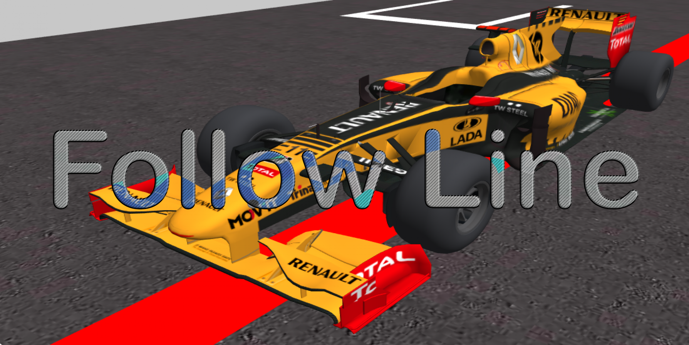

# Robotic memories
In this web I will solve and comment on the practices developed in the Robotic Vision subject. This subject belongs to the Master's degree in Computer Vision of the URJC.
I am Javier Albaráñez Martínez, a student of this university master's program.

## Practices
1. [**Follow line**](P1_FollowLine/FollowLine.md), this practice consists of modeling artificial intelligence capable of controlling an autonomous car. To do this, we have at our disposal an environment modeled virtually on the [Unibotics](https://unibotics.org/) website.

  

2. [**3D Reconstruction**](P2_3D/3DReconstruction.md), this time, we will reconstruct a 3D environment using the information obtained by two cameras. As in the previous time, this practice is developed on the [Unibotics](https://unibotics.org/) website. Where we are provided with all the necessary tools to accomplish this objective.

  

